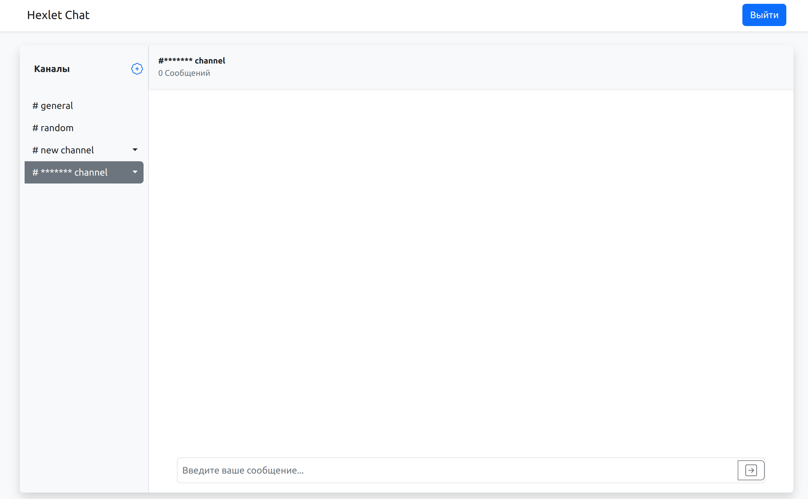

### Hexlet tests and linter status:

____________
## Описание проекта:
**Hexlet Chat** - это мой дипломный проект, выполненный в рамках обучения на платформе Hexlet. 
Hexlet-Chat представляет собой SPA приложение для обмена сообщениями в режиме реального времени.

В основе проекта лежит использование современных технологий и инструментов, которые широко применяются в повседневной работе фронтенд-разработчиков. В процессе разработки проекта были решены различные задачи, такие как работа с веб-сокетами для обеспечения мгновенной передачи сообщений, взаимодействие с REST API для обработки запросов к серверу, организация клиентского роутинга для управления переходами между страницами.

Основная функциональность Hexlet Chat включает возможность создания и присоединения к различным каналам для общения, отправку и прием сообщений в режиме реального времени, а также функции управления каналами, такие как переименование и удаление. Пользователи могут взаимодействовать друг с другом, обмениваясь сообщениями и создавая новые каналы для обсуждения различных тем.

Проект также включает в себя функциональность аутентификации и авторизации пользователей, чтобы обеспечить безопасность и контроль доступа к чату. Для улучшения пользовательского интерфейса и ускорения разработки в проекте использовались популярные библиотеки и инструменты, такие как React, Redux с использованием reduxjs/toolkit, react-bootstrap для создания пользовательского интерфейса с использованием готовых компонентов.

Проект также включает процессы сборки и деплоя, что позволяет его запускать в реальной среде и делиться им с другими пользователями.

## Стек технологий:

- **React / React Hooks** - для создания пользовательского интерфейса и управления компонентами.
- **Redux / Redux Toolkit** - для управления состоянием приложения.
- **Bootstrap** - CSS-фреймворк для создания стилей и компонентов интерфейса.
- **Socket.io** - обеспечивает двустороннюю связь между браузером и сервером с использованием протокола WebSocket.
- **Axios** - для выполнения HTTP-запросов к серверу.
- **Formik** - для создания и управления формами на основе React.
- **Yup** - для проведения валидации форм и проверки вводимых данных.
- **I18next** - для управления мультиязычностью и переводом текстовых ресурсов в приложении.
- **React-toastify** - для создания всплывающих уведомлений и сообщений для пользователей.
- **Leo-profanity** - для фильтрации неприемлемых слов и контента в сообщениях.
- **Rollbar** - для отслеживания и регистрации ошибок и исключений в процессе работы приложения.

## Инструкция по установке и запуску:

- Клонируем репозиторий с проектом, с помощью команды: git clone 
- Переходим в директорию с проектом, с помощью комадны: cd <нужная директория>.
- Устанавливаем зависимости проекта, с помощью команды: make install.
- Запускаем проект с помощью make start

## Демонстрация

## Деплой:

[BEST-CHAT](https://bestchat.up.railway.app/)
